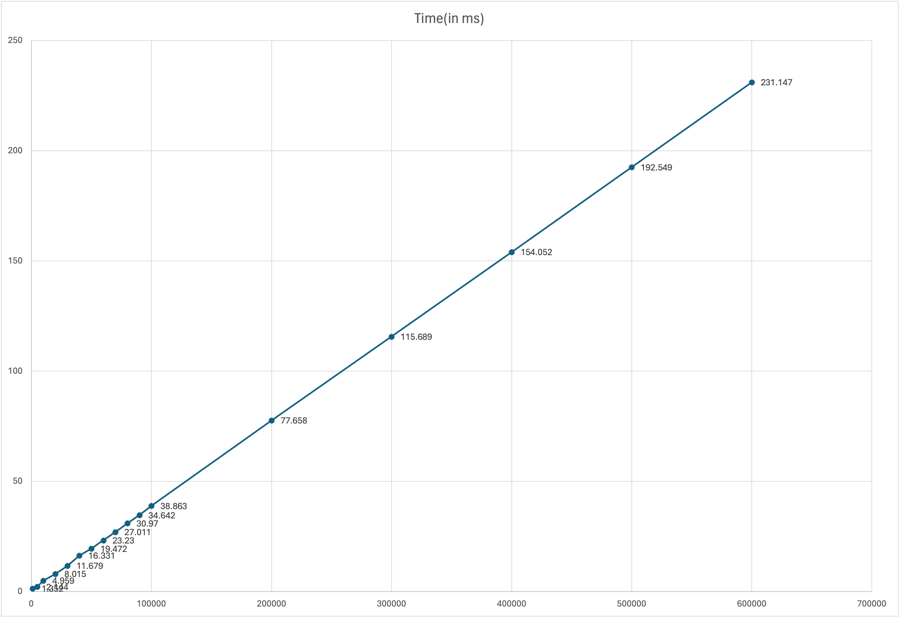

# Encryption Assignment

## Setup

The assignment has been written in TypeScript. To run the code, please follow the given steps:

1. Install `nodejs` and `npm` if not already installed
2. run `npm install` in the project directory to install all dev dependencies.
3. For encypting a file, run `encryptor.ts` i.e., the encryption utility. Sample command is provided below:
  `ts-node encryptor.ts --filePath ./test.txt --password [password] --encryptionAlgorithm aes-256-cbc --hashingAlgorithm sha512 --iterations 10000`
4. For decrypting a file, run `decryptor.ts` i.e., the decryption utility. Sample command is provided below:
  `ts-node decryptor.ts --filePath ./test.txt --password [password]`

## Overview

In this section, I will provide a brief overview of the project structure and design choices made for the assignment.

1. Both encryption and decryption utilities are in separate source files as I wanted to make seperate command line utilities for each task with different set of parameters.

2. Encryption utility generates a `JSON` file with the name `[filename].enc.json` after successful encryption. I chose to go with `JSON` for the ease of handling and destructuring of attributes when writing to and reading from the file. The decryption utility recreates the encrypted file with it's current extension in the same directory as the program. The code has been tested with image files, `.docx`, and `.txt` files.

3. PKCS7 padding is automatically handled by the native Node.js [`crypto` library](https://nodejs.org/api/crypto.html#ciphersetautopaddingautopadding) hence the method `cipher.setAutoPadding(true);` is enough to handle padding if input that is not a multiple of the block size for the selected encryption algorithm.

4. `utils.ts` and `Types.ts` files contain helpers for both utilities, with `utils.ts` containing common functions such as key generator and command argument parser while `Types.ts` contains custom types defined for metadata and the structure for the final encrypted file.

## Iteration Count

The decision to use 600,000 iterations for the encryption utility was made strategically, taking into account security needs as well as performance factors. The presented time metrics show a non-linear increase in calculation time with the number of iterations. At smaller iteration counts, such as 1000 and 5000, the time overhead is quite small; however, as the iteration count increases, the time required for encryption increases dramatically. However, it has been noticed that at a certain threshold, the increase in time becomes more evident with each consecutive iteration. Given this, 600,000 iterations find a balance between increasing security and retaining acceptable speed. While it adds a notable time overhead of roughly 231.147 milliseconds, it significantly increases the computational cost for potential attackers, enhancing the security of the encryption process. Moreover, aligning with the latest OWASP recommendation further solidifies the choice, ensuring adherence to industry best practices in cryptographic security.

### Key Generation Time Metrics

| Iterations        | Time(in ms) |
| :---------------- | ----: |
|1000 | 1.352 |
|5000 | 2.144 |
|10000 | 4.959 |
|20000 | 8.015 |
|30000 | 11.679 |
|40000 | 16.331 |
|50000 | 19.472 |
|60000 | 23.23 |
|70000 | 27.011 |
|80000 | 30.97 |
|90000 | 34.642 |
|100000 | 38.863 |
|200000 | 77.658 |
|300000 | 115.689 |
|400000 | 154.052 |
|500000 | 192.549 |
|600000 | 231.147 |

### References

1. <https://www.ietf.org/rfc/rfc2898.txt>
2. <https://neilmadden.blog/2023/01/09/on-pbkdf2-iterations/>
3. <https://en.wikipedia.org/wiki/PBKDF2>
